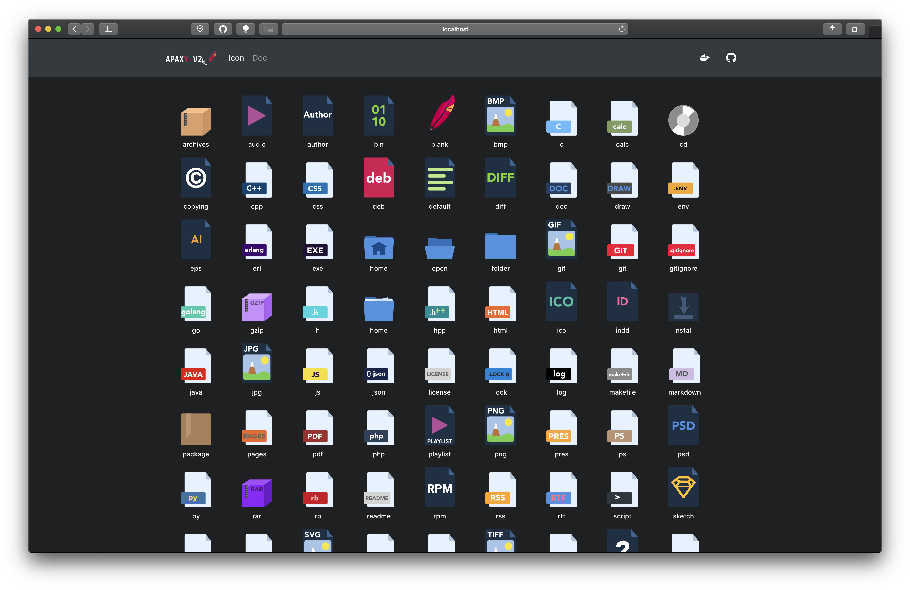

# Apaxy_v2_web

#### Web app for a simple presentation of the Repository [Apaxy-V2](https://github.com/fusengine/apaxy-v2) 
#### An original project by [Fusengine](https://fusengine.ch)



## Apaxy V2


<br><hr><br>

# REMINDER
## Install React 
```sh
$ yarn global add create-react-app
$ create-react-app myreactwebappname
```
## Install node.js
```sh
$ yarn install 
```
## Runing React App
```sh
$ cd myreactwebappname
$ yarn start 
# will automatically open the project in localhost
```

<br>

## Install Bootstrap to a React project
```sh
$ yarn add bootstrap 
```

Add this line to src/index.js:
```html
import 'bootstrap/dist/css/bootstrap.css';
```

<br>

## install [ReactMarkdown](https://github.com/rexxars/react-markdown)
```sh
$ yarn add react-markdown
```

<br><hr><br>

&copy; 2018 [Alexia Lechot](https://uxmilk.co)

